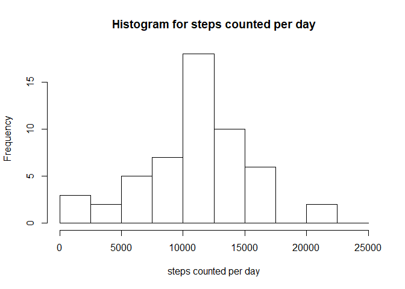
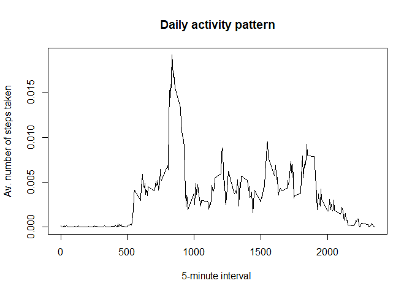
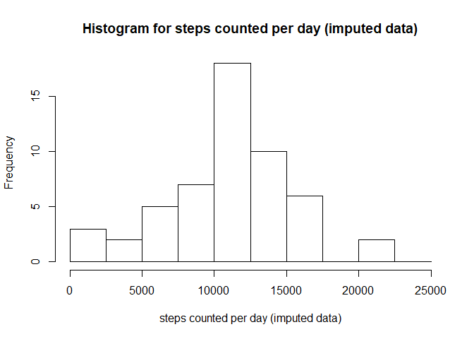
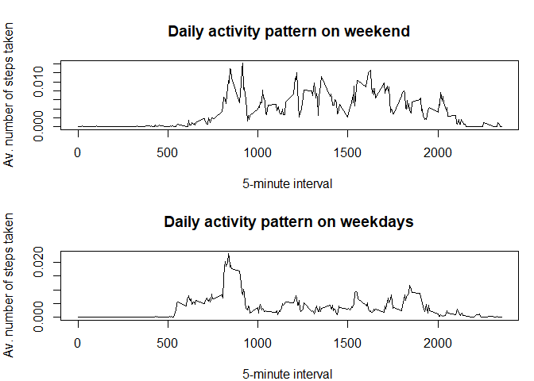

1 - Introduction
================

This is an R Markdown file containing code chunks and explanatory texts to finish the first peer assignment in 'reproducible research' at Coursera.org.

The assignment makes use of data from a personal activity monitoring device. It collects data at 5 minute intervals through out the day. The data consists of two months of data from an anonymous individual collected during the months of October and November, 2012 and include the number of steps taken in 5 minute intervals each day.

The data can be downloaded from the course web site:

Dataset: [Activity monitoring data](https://d396qusza40orc.cloudfront.net/repdata%2Fdata%2Factivity.zip) \[52K\]

The variables included in this dataset are:

-   **steps**: Number of steps taking in a 5-minute interval (missing values are coded as NA)
-   **date**: The date on which the measurement was taken in YYYY-MM-DD format
-   **interval**: Identifier for the 5-minute interval in which measurement was taken

2 - Data Analysis
=================

To perform the data analysis we begin with loading the data and then perform the tasks from the assignment.

Loading and Preprocessing data
------------------------------

We apply `read.csv` to store the given data in the variable data.

``` r
data <- read.csv("activity.csv")
```

We transform the second column, namely the column including dates, into the date format.

``` r
data[,2] <- as.Date(data[,2], format = "%Y-%m-%d")
```

To have a quick glance at the dataset one could execute `str(data)`, `summary(data)` and `head(data)`.

Tasks
-----

1.  What is the mean total number of steps taken per day?

As a first step, we create a new data frame using the plyr package, i.e.

``` r
library(plyr)
stepcountperday <- ddply(data, .(date), summarize, stepsum=sum(steps))
```

This code chunk creates a new data frame `stepcountperday` counting the steps for each day. It has 61 rows and 2 columns. We take the second column to plot a histogram.

``` r
hist(stepcountperday[,2],main="Histogram for steps counted per day", breaks = seq(0,25000,by=2500),xlab="steps counted per day")
```



Furthermore, we calculate the mean and median for the total amount of steps per day removing NAs, i.e.

``` r
mean(stepcountperday[,2],na.rm=TRUE)
```

    ## [1] 10766.19

``` r
median(stepcountperday[,2],na.rm=TRUE)
```

    ## [1] 10765

1.  What is the average daily activity pattern?

To find out more about the daily activity pattern we create a data frame `stepcountinterval` using plyr package, i.e.

``` r
stepcountperinterval <- ddply(data, .(interval), summarize, stepsum=sum(steps,na.rm=TRUE))
```

We create a time series plot using the given 5-minute intervals on the x-axis, plotting the average number of steps taken on the y-axis, i.e.

``` r
plot(stepcountperinterval[,1],stepcountperinterval[,2]/sum(stepcountperinterval[,2]),type="l",xlab="5-minute interval ", ylab="Av. number of steps taken", main="Daily activity pattern")
```



Here, the y-axis values are divided by the total number of steps to average adequatly. To find out at what interval the maximum averaged value was detected, we apply the following which statement:

``` r
stepcountperinterval[which.max(stepcountperinterval[,2]),1]
```

    ## [1] 835

1.  Imputing missing values

First, we count the occuring NAs in the data frame `data`, i.e.

``` r
sum(is.na(data[,1]))
```

    ## [1] 2304

There are several strategies for imputing the 2304 missing values in the data frame`data`. In this case we want to replace each occuring NA by the average step amount per day. Still there is a crucial point to add. There are some days, where there are no values at all producing an NA entry for the daily average. In this case we replace the missing values for the whole day by the floor average of the step averages. We store this in a new data frame called `data_new`.

After duplicating the given data into `data_new`, we extract a data frame for the average amount of steps per day and a global average, i.e.

``` r
data_new <- data
stepaverageperday <- ddply(data, .(date), summarize, stepave=mean(steps,na.rm=TRUE))
globaverage <- floor(mean(stepaverageperday,na.rm=TRUE))
```

    ## Warning in mean.default(stepaverageperday, na.rm = TRUE): argument is not
    ## numeric or logical: returning NA

We store the dates where there are no values available in the vector `isnadates`, i.e.

``` r
isnadates <- stepaverageperday[which(is.na(stepaverageperday[,2])),1]
```

We impute the corresponding data frame `data_new? such that whereever the date corresponds to the 8 items in`isnadates\`, then this item is set to 37.

``` r
data_new[(data_new[,2] %in% isnadates),1] <- globaverage
```

After counting the missing values again we find that there are no missing values left and we might go on with further questions. To figure out how imputed values bias a data frame we perform the same analysis as above.

``` r
stepcountperday_new <- ddply(data_new, .(date), summarize, stepsum=sum(steps))
hist(stepcountperday_new[,2],main="Histogram for steps counted per day (imputed data)", breaks = seq(0,25000,by=2500),xlab="steps counted per day (imputed data)")
```



The mean and median are calculated as follows

``` r
mean(stepcountperday_new[,2],na.rm=TRUE)
```

    ## [1] 10766.19

``` r
median(stepcountperday_new[,2],na.rm=TRUE)
```

    ## [1] 10765

We find the mean and median to be untouched in comparison to the above analysis even though the amount of steps has increased at about more than 85000 in total, i.e.

``` r
sum(data_new[,1])-sum(data[,1],na.rm=TRUE)
```

    ## [1] NA

1.  Are there differences in activity patterns between weekdays and weekends?

First, we create a factor variable using `weekdays()` and the local time settings to store this in a new row `activitypattern`, i.e.

``` r
Sys.setlocale("LC_TIME", "English")
```

    ## [1] "English_United States.1252"

``` r
week_days <- c('Monday', 'Tuesday', 'Wednesday', 'Thursday', 'Friday')
data_new$activitypattern <- factor((weekdays(data_new$date) %in% week_days),levels=c(FALSE, TRUE), labels=c('weekend', 'weekday'))
```

We save the average interval steps categorized by the activity pattern factor variable.

``` r
stepcountperinterval_weekday <- ddply(data_new[(data_new[,4]=='weekday'),], .(interval), summarize, stepsum=sum(steps,na.rm=TRUE))
stepcountperinterval_weekend <- ddply(data_new[(data_new[,4]=='weekend'),], .(interval), summarize, stepsum=sum(steps,na.rm=TRUE))
```

Afterwards we adopt the technique from above to create a time series plot using a panel plot to find a higher afternoon and evening activity pattern on weekends compared to weekdays.

``` r
par(mfrow=c(2,1),mar=c(4,4,4,1))
plot(stepcountperinterval_weekend[,1],stepcountperinterval_weekend[,2]/sum(stepcountperinterval_weekend[,2]),type="l",xlab="5-minute interval ", ylab="Av. number of steps taken", main="Daily activity pattern on weekend")
plot(stepcountperinterval_weekday[,1],stepcountperinterval_weekday[,2]/sum(stepcountperinterval_weekday[,2]),type="l",xlab="5-minute interval ", ylab="Av. number of steps taken", main="Daily activity pattern on weekdays")
```


